# wait와 notify 보다는 동시성 유티리티를 애용하라

## 🚨  `wait` 과 `notify`을 지양합시다. 

Java에서 스레드를 다룰 때 흔히 쓰이는 메서드로 wait(), notify() 메소드가 Object에 구현되어있습니다.
해당 스레드가 잠시 멈추어야 할 때는 wait()를 호출하고, 정지된 스레드를 다시 실행시키기 위해서 notify()를 호출하면 됩니다. 
하지만 하지만 올바르게 사용하기가 까다롭고 현재는 고수준의 동시성 제어를 제공하는 유틸리티들이 존재하하는 상황에서
wait와 notify로 기능을 직접 구현하기 보다  고수준 동시성 유틸리티를 사용하는 것이 좋습니다.

## 😰 wait()와 notify()의 문제점

wait()와 notify()는 스레드 간 동기화의 기초적인 방법이지만, 올바르게 사용하려면 다음 조건을 반드시 지켜야 합니다.

- 반드시 `synchronized` 블록 내에서 호출해야 하며, 그렇지 않으면 `IllegalMonitorStateException`이 발생합니다.

- 조건 검사를 반복문 안에서 수행해야 합니다. 이를 지키지 않으면 조건이 충족되지 않은 채로 스레드가 깨어날 수 있습니다(허위 각성).

- 특정 스레드를 지정해 깨우는 것이 불가능하기 때문에, notify() 대신 notifyAll()을 사용하는 것이 더 안전합니다.

잘못된 예시
```java
// 위험한 wait() 사용 예시
synchronized (lock) {
    if (!condition) { // 조건 검사가 1회만 수행됨
        lock.wait();
    }
    // 조건이 충족되지 않아도 작업이 수행될 가능성 있음
}
```
이러한 방식은 잠재적인 오류를 내포하고 있으며 성능 또한 최적화하기 어렵습니다.

Java 5부터는 복잡한 스레드 관리를 보다 쉽게 해주는 `java.util.concurrent` 패키지가 도입되었습니다. 이 유틸리티는 크게 세 가지로 나뉩니다.

실행자 프레임워크(executor framework)  👉🏻 아이템80을 참고하세요
동시성 컬렉션(concurrent collection)
동기화 장치(synchronizer)

## 1️⃣ 동시성 컬렉션 (Concurrent Collections)

자바의 표준 컬렉션(Map, List)은 기본적으로 동시성을 지원하지 않습니다. 
표준 컬렉션(List, Queue, Map)에 `동시성`을 추가하여 안전하면서도 성능이 뛰어난 컬렉션입니다.

대표적 클래스: ConcurrentHashMap, CopyOnWriteArrayList, ConcurrentLinkedQueue

### 1. 동시성 컬렉션(Map 계열)

① HashMap
•	동시성 지원 없음
•	여러 스레드가 동시 접근하면 데이터가 깨질 위험이 있음.
•	예시로 멀티스레드 환경에서 HashMap을 쓰면 실제 size()가 기대했던 1000이 아닌 더 큰 값이 나온다. 이는 내부적으로 동기화 없이 put() 전에 크기를 미리 증가시키기 때문이다.

② Hashtable
•	메서드 단위로 동기화가 걸려 있어 스레드 안전성을 보장하지만 성능이 떨어진다.
•	메서드에 synchronized 키워드를 사용해 동시 접근을 막는다.
•	성능이 느리다는 단점이 있다.

③ ConcurrentHashMap
•	블록 단위로 동기화를 적용해 높은 성능과 동시성을 모두 만족하는 컬렉션이다.
•	Hashtable의 메서드 전체가 아닌 블록 단위로 동기화하므로 성능이 좋다.

```mermaid
gantt
    title 컬렉션 연산 시간 비교 (1억 회 조회)
    dateFormat  X
    axisFormat  %sms
    section HashMap
    HashMap         :done, 0, 844
    section synchronizedMap
    synchronizedMap :done, 0, 1728
    section ConcurrentHashMap
    ConcurrentHashMap :done, 0, 672
```




실제 성능 면에서도 `ConcurrentHashMap`이 우수한 것으로 나타납니다.


✅예시 코드 (ConcurrentHashMap.put())
```java
Map<String, Integer> concurrentHashMap = new ConcurrentHashMap<>();
// 동시성 처리됨 (외부 synchronized 필요없음)
concurrentHashMap.put("key1", 1);
```

✅ 책에서 소개된 성능 최적화 코드 (putIfAbsent()):

기본 put()보다 더 안전한 형태의 동작을 원하는 경우 제공된 putIfAbsent를 사용할 수 있습니다.
```java
private static final ConcurrentMap<String, String> map = new ConcurrentHashMap<>();

public static String intern(String s) {
    String existingValue = map.putIfAbsent(s, s);
    return existingValue == null ? s : existingValue;
}
```
이때는 기존 값이 없을 때만 넣으므로 동기화 문제 없이 안전합니다.


✅ 추가로 성능 최적화 방법
•	ConcurrentHashMap은 get() 메서드가 매우 빠르므로, putIfAbsent() 호출 전에 먼저 get()을 호출하면 더 좋은 성능을 얻을 수 있습니다. 
```java
private static final ConcurrentMap<String, String> map = new ConcurrentHashMap<>();

public static String intern(String s) {
    String result = map.get(s);
    if (result == null) {
        result = map.putIfAbsent(s, s);
        if (result == null) {
            result = s;
        }
    }
    return result;
}
```

🤔왜 더 빠른가요?
이미 존재하는 키에 대한 중복 삽입 시도가 자주 발생한다면, 값이 이미 있는 경우 putIfAbsent의 오버헤드를 피하고 get을 통해 빠르게 확인 후 처리를 할 수 있기 때문!

### 3. BlockingQueue - 동시성 컬렉션 (Queue 계열)

① BlockingQueue
•	데이터를 가져올 때 큐가 비어있다면 데이터가 들어올 때까지 **대기(block)**하는 큐입니다.
•	생산자와 소비자 간의 효율적인 데이터 처리가 가능합니다
•   조건을 자동으로 처리하여 불필요한 wait-notify 로직을 간단히 대체합니다.


예시 코드 
```java
BlockingQueue<String> queue = new LinkedBlockingDeque<>();

// 원소가 없으면 block되므로 이 코드만 실행하면 끝나지 않는다.
queue.take();
```
② 생산자-소비자 패턴 예시
```java
BlockingQueue<String> queue = new LinkedBlockingQueue<>();
ExecutorService executor = Executors.newFixedThreadPool(3);

// 생산자
executor.execute(() -> {
        while (true) {
        queue.put("작업: " + System.currentTimeMillis());
        Thread.sleep(1000);
    }
            });

// 소비자
            executor.execute(() -> {
        while (true) {
String task = queue.take(); // queue에 데이터가 없으면 여기서 block됨
        System.out.println("처리 완료: " + task);
    }
            });
```
위 코드에서 생산자가 데이터를 큐에 넣을 때만 소비자가 가져갈 수 있어, 블로킹을 이용해 생산-소비 모델을 안전하고 효율적으로 구현할 수 있습니다.

📌 정리하자면...

>•	간단한 멀티스레드 환경:
> → Collections.synchronizedMap() 사용 가능
> •	고성능이 중요한 멀티스레드 환경:
> → ConcurrentHashMap 적극 권장
> •	대기 및 생산-소비 모델이 필요할 때:
> → BlockingQueue 적극 활용


## 2️⃣ 동기화 장치 (Synchronizers)

### 🔑 동기화 장치란?

여러 개의 스레드가 서로의 작업이 끝나길 기다리거나 서로의 상태를 조율할 수 있도록 돕는 장치를 동기화 장치라고 부릅니다.

대표적인 예시로는 다음이 있습니다:

CountDownLatch: 설정된 작업이 모두 완료될 때까지 기다리는 장치입니다.

Semaphore: 접근 가능한 스레드 수를 제한하여 리소스를 보호합니다.

CyclicBarrier: 스레드 그룹이 특정 지점까지 도달할 때까지 기다리도록 합니다.


## 🚩 CountDownLatch 간단히 살펴보기

CountDownLatch 는 설정된 숫자가 0이 될 때까지 특정 스레드를 기다리게(블로킹) 만드는 역할을 수행합니다.
•	초기에 지정한 숫자(count) 만큼 다른 스레드들이 카운트를 감소(countDown())시킵니다.
•	카운트가 0이 될 때까지 기다리던 스레드는 await()을 호출하여 멈춰 있게 됩니다.

•	countDown() 메서드: 숫자를 하나씩 감소
•	await() 메서드: 카운트가 0이 될 때까지 대기

**CountDownLatch의 실전 활용 예시**

스레드가 정확히 동시에 작업을 시작하도록 하여 작업 시간을 측정할 때 사용할 수 있다.

```java
final int concurrency = 3;

ExecutorService executorService = Executors.newFixedThreadPool(concurrency);

CountDownLatch readyLatch = new CountDownLatch(concurrency);
CountDownLatch startLatch = new CountDownLatch(1);
CountDownLatch doneLatch = new CountDownLatch(concurrency);

for (int i = 0; i < concurrency; i++) {
        executorService.execute(() -> {
        ready.countDown(); // 준비 완료 알림
        try {
                start.await(); // 시작 신호 대기
            System.out.println("작업 수행");
        } catch (InterruptedException e) {
        Thread.currentThread().interrupt();
        } finally {
                doneLatch.countDown(); // 작업 완료 알림
        }
                });
                }

                ready.await();       // 모든 스레드가 준비될 때까지 기다림
long startTime = System.nanoTime(); 
start.countDown();   // 동시에 작업 시작
doneLatch.await();    // 모든 작업 완료 대기

System.out.println(System.nanoTime() - startNanos);
```

각 CountDownLatch 역할 정리:

•	ready 래치
모든 작업자 스레드가 준비되었음을 알리는 역할.
•	start 래치
준비된 모든 스레드를 동시에 시작시키는 역할.
•	doneLatch 래치
모든 스레드가 작업을 완료했음을 알리는 역할.

✅ 자주 하는 실수:
•	ExecutorService의 스레드 수는 반드시 동시성 수준(concurrency) 이상의 개수로 만들어야 한다.
•	예를 들어 3개의 동시성 작업이라면 최소 3개 이상의 스레드가 필요하다.
•	그렇지 않으면 await() 상태에서 무한 대기에 빠질 수 있다.


### ⚠️ wait()와 notify()를 어쩔 수 없이 써야 한다면?

자바의 스레드 동기화 장치로 가장 오래된 방식인 **wait()**과 notify() 는, 여전히 레거시 코드에서 자주 접하게 된다. 사용법이 까다롭고 실수가 잦은 만큼, 확실한 이해가 필요하다.

📌 1. 기본적인 사용 방식

표준적인 wait() 사용 방법은 아래와 같다.

```java
void check() throws InterruptedException {
    synchronized (lock) {
        while (!flag) {        // ★반드시 반복문 사용!
            System.out.println("Wait");
            lock.wait();
        }
        System.out.println("Flag is True");
    }
}
```

반복문(while) 안에서 조건 검사 후 wait()을 호출한다.
•	깨어난 후에도 다시 조건을 검사해 동작을 수행한다.


📌 2. 왜 반복문 안에서 호출해야 할까?

반복문 없이 단순히 if문으로 검사하면 다음과 같은 문제가 발생합니다.
•	깨어났을 때 여전히 조건을 만족하지 않을 수 있습니다.
•	wait() 후 깨어난 스레드가 즉시 작업을 수행하면 공유 자원의 상태가 깨질 위험이 있습니다.

예시 상황 🔻
•	스레드 A가 조건을 검사한 후 wait() 상태로 들어갔다.
•	악의적인 스레드 또는 실수로 인해 잘못된 타이밍에 notify()가 호출됐다.
•	스레드 A가 깨어나 곧바로 조건 검사 없이 동작을 수행하면 공유 상태가 손상된다.

즉, 의도와 관계없이 깨어날 수 있기 때문에, 항상 조건을 다시 검사하도록 반복문을 사용하는 것입니다.

📌 3. notify() 보다는 notifyAll()이 더 안전합니다. 

•	**notify()**는 하나의 대기 중인 스레드만 깨운다.
•	잘못된 스레드가 깨어날 경우, 정작 필요한 스레드는 영영 깨어나지 못할 수 있다.
•	반면 **notifyAll()**은 모든 스레드를 깨우고, 깨어난 스레드들이 각자 조건을 재검사한 후, 조건이 맞지 않다면 다시 대기 상태로 돌아간다.

따라서 의도치 않게 잘못된 스레드가 깨어나도 안정성을 유지할 수 있습니다.

📌 4. 악의적인 상황과의 대비

아래와 같은 악의적 상황도 고려해야 합니다. 

•	어떤 스레드가 악의적으로 무한 반복으로 wait()을 호출하여 중요한 스레드가 받을 notify()를 가로챌 수 있다.
•	이 경우 notify()를 기다리는 스레드가 영원히 깨어나지 못할 위험이 있다.

이를 방지하려면:
•	반드시 조건을 반복적으로 검사(while)하도록 만들고
•	안전하게 **notifyAll()**을 사용하는 것이 중요하다.

•	[✅] 반드시 wait() 호출 전후로 조건을 반복 검사하자.
•	[✅] 단일 notify() 대신, 안전한 notifyAll()을 사용하자.
•	[✅] 깨어난 스레드가 조건을 재확인하여 작업을 수행할 수 있도록 구조화하자. 

이 세 가지 원칙을 지키면, 레거시 코드에서도 보다 안전하게 동기화 문제를 관리할 수 있다.

---

🎯핵심 정리

더 이상 오류가 발생하기 쉽고 복잡한 wait()와 notify() 보다는 동시성 유틸리티를 사용합시다. 
Java의 고수준 동시성 유틸리티는 안전성과 성능을 모두 제공하며, 코드를 더 명료하고 유지보수하기 쉽게 만들어줍니다.